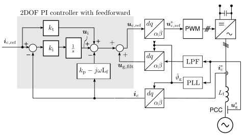

Current Control
===============
In grid-converter applications the normal two-degrees-of-freedom PI controller is extended
with a additional feedforward signal. This improves the performance since in reality the voltages 
in grid are not a perfect three-phase sine waves. [#Har2009]_

   
   2DOF PI controller, with filtered feedforward signal

In this implementation is used a discrete-time 2DOF synchronous-frame complex-vector PI
controller similar to [#Bri2000]_, with an additional feedforward signal.                        

.. math::     
    \boldsymbol{u}_\mathrm{c,ref} = \boldsymbol{k}_\mathrm{p}*(\mathbf{i}_{ref} - \mathbf{i}_c) + \boldsymbol{k}_\mathrm{i}/s*(\mathbf{i}_{ref} - \mathbf{i}_c) + j*w*L_f*\mathbf{i}_c + \mathbf{u}_{g,filt} 
    :label: ComplexFFPI

where :math:`\boldsymbol{u}_\mathrm{c,ref}` is the reference voltage, :math:`\boldsymbol{k}_\mathrm{p}` and :math:`\boldsymbol{k}_\mathrm{i}` are the proportional and integral gains,
:math:`\boldsymbol{k}_t` is reference-feedforward gain, :math:`\mathbf{i}_{ref}` is the reference current, :math:`\mathbf{i}_c` is the measured current, 
:math:`\mathbf{u}_{g,filt}` is the filtered feedforward grid voltage, 
and :math:`j \omega L_f` is the decoupling term estimate.

The gain selection corresponding to internal-model-control (IMC) is
equivalent to the continuous-time version given in [#Har2009]_.

.. math::                
    \boldsymbol{k}_\mathrm{p} = 2L_f\alpha_\mathrm{c} \qquad\qquad
    \boldsymbol{k}_\mathrm{i} = L_f\alpha_\mathrm{c}^2  \qquad \qquad
    \boldsymbol{k}_\mathrm{t} = L_f\alpha_\mathrm{c} 
    :label: ComplexFFPI_gains

Notice that selection kt = kp yields the standard (1DOF) PI-controller.

The synchronization to the grid is done by a phase-locked loop (PLL) or by a power-synchronization loop (PSL) 
and the grid voltage angle estimate :math:`\hat{\vartheta}_g` is calculated either by the PLL or by the PSL. 
This algorithm is compatible with both real and complex signals. 
The integrator anti-windup is implemented based on the realized controller output.

This controller is implemented in the class :class:`motulator.common.control.ComplexFFPIController`.

.. rubric:: References

.. [#Har2009] Harnefors, Bongiorno, "Current controller design
       for passivity of the input admittance," 2009 13th European Conference
       on Power Electronics and Applications, Barcelona, Spain, 2009. https://doi.org/10.1109/EPE.2009.5276547

.. [#Bri2000] Briz, Degner, Lorenz, "Analysis and design of current 
       regulators using complex vectors," IEEE Trans. Ind. Appl., 2000,
       https://doi.org/10.1109/28.845057

