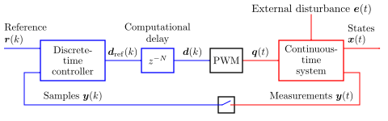

System Model
============

Grid converters are sampled-data systems, consisting of continuous-time 
systems and discrete-time systems as well as the interfaces between them 
[#Fra1997]_, [#Bus2015]_. The figure below shows a generic example system. 
The same architecture is used in *gritulator*.

   Block diagram of a sampled-data system. Discrete signals and systems are 
   shown in blue, and continuous signals and systems are shown in red. 

The continuous-time system (named `mdl` in :doc:`/auto_examples/index`) is the 
model of a physical grid-converter system, typically consisting of a power 
converter, grid, and filter, such as an LCL filter, between the converter and 
the grid. The continuous-time system may have external inputs, such as a power 
fed to a DC-bus of the converter.

The discrete-time controller (named `ctrl`) contains control algorithms, such as 
current control and DC-bus voltage control. The reference signals could be, 
e.g., the voltage and power references. The feedback signal 
:math:`\boldsymbol{y}(k)` typically contains the measured DC-bus voltage and 
converter currents. 

Digital control systems typically have a computational delay of one sampling 
period, :math:`N=1`. The PWM block shown in the figure models the carrier 
comparison, see more details in :doc:`../converters`. The carrier comparison is 
implemented in the class :class:`gritulator.model.CarrierComparison`. If the 
switching ripple is not of interest in simulations, the carrier comparison can 
be replaced with zero-order hold (ZOH).

.. rubric:: References

.. [#Fra1997] Franklin, Powell, Workman, "Digital Control of Dynamic Systems," Menlo Park, CA, USA: Addison-Wesley, 1997

.. [#Bus2015] Buso, Mattavelli, "Digital Control in Power Electronics," 2nd ed.,  Morgan & Claypool, 2015, https://doi.org/10.2200/S00637ED1V01Y201503PEL007
