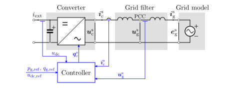

System Model
============

The figure below shows an example grid converter system. The different subsystems of the
continuous-time system model are drawn with a shaded background.

   Diagram of a grid converter system. Discrete-time sampled signals are shown in blue. 

